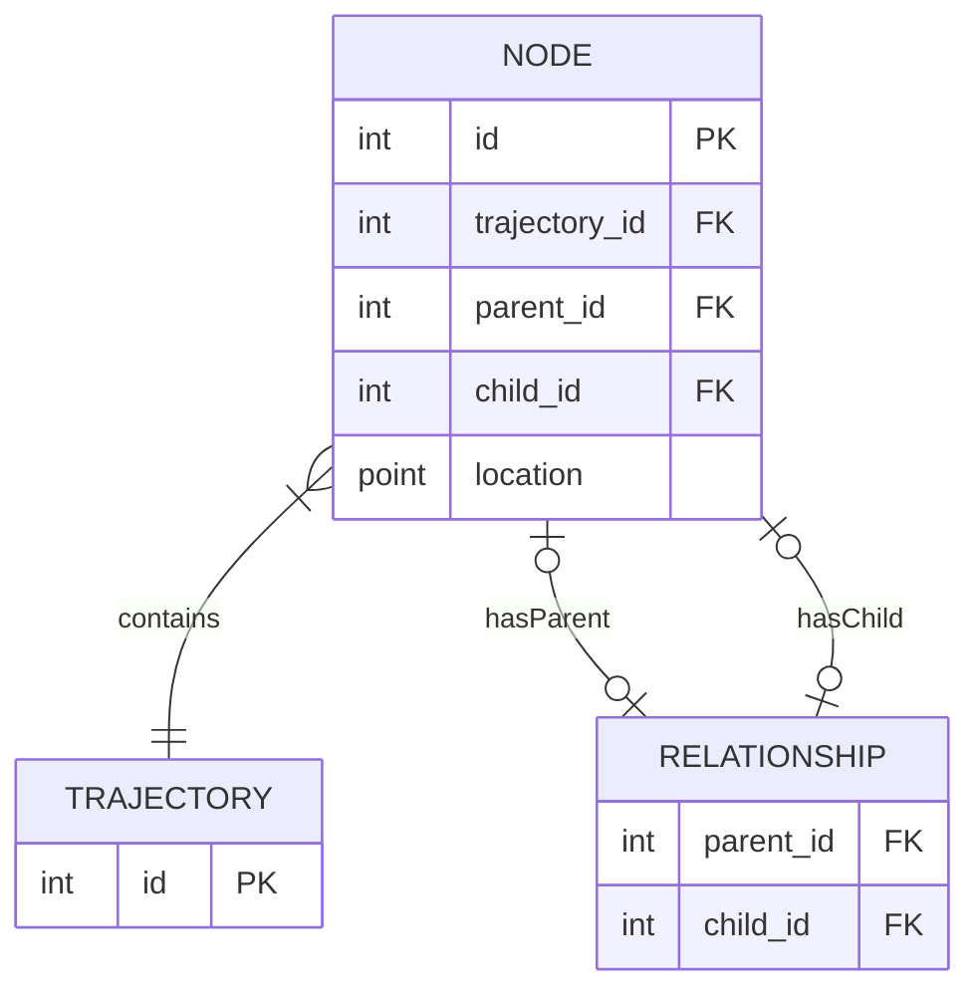

```mermaid
	erDiagram
	NODE {
		int id PK
		int trajectory_id FK
		int parent_id FK
		int child_id FK
		point location
	}
	
	RELATIONSHIP {
		int parent_id FK
		int child_id FK
	}

	TRAJECTORY {
		int id PK
	}
	NODE }|--|| TRAJECTORY: contains
	RELATIONSHIP |o--o| NODE: hasChild
	NODE |o--o| RELATIONSHIP: hasParent
	
```

